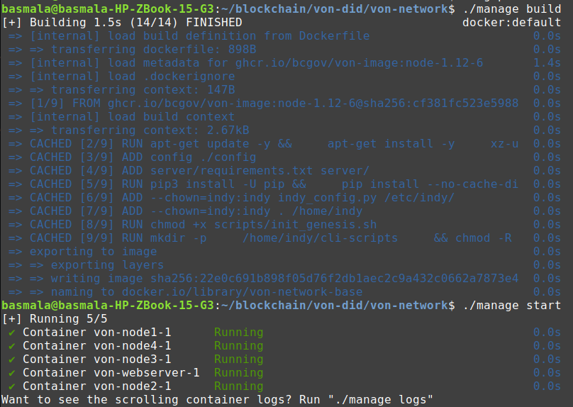
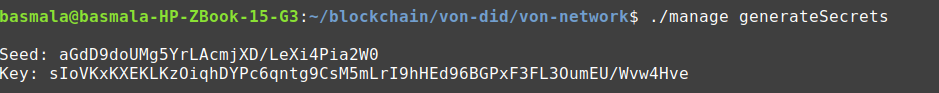
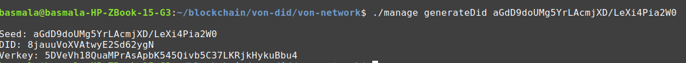

This repo was created to track my notes and learn more about interacting with indy-cli.

I'll be using Using the [VON Network](https://github.com/bcgov/von-network) containerized indy-cli.

### Before Starting With Indy-cli
Building and starting the network



Generate a seed and verkey for the DID 



```Seed: aGdD9doUMg5YrLAcmjXD/LeXi4Pia2W0
Key: sIoVKxKXEKLKzOiqhDYPc6qntg9CsM5mLrI9hHEd96BGPxF3FL3OumEU/Wvw4Hve
```

Use that seed to generate a new DID



Register that DID on the VON network

open [http://localhost:9000/](http://localhost:9000/)

register using the seed

this appears :

Identity successfully registered:
Seed: aGdD9doUMg5YrLAcmjXD/LeXi4Pia2W0
DID: 8jauuVoXVAtwyE2Sd62ygN
Verkey: 5DVeVh18QuaMPrAsApbK545Qivb5C37LKRjkHykuBbu4

### Indy-cli
